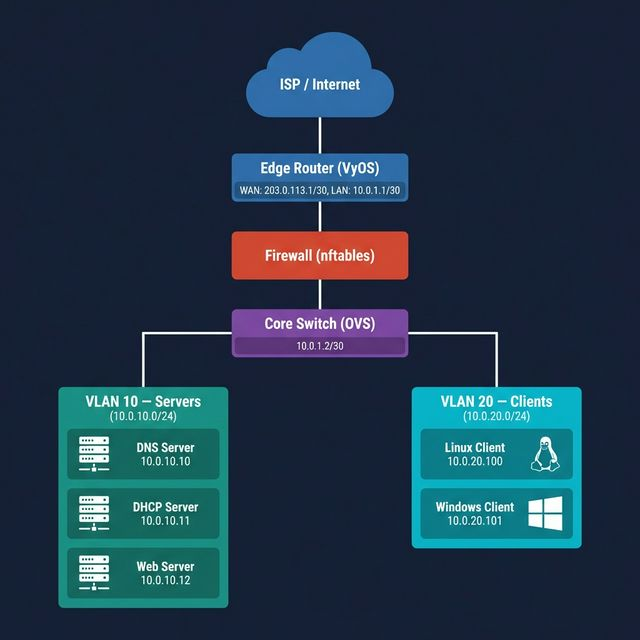
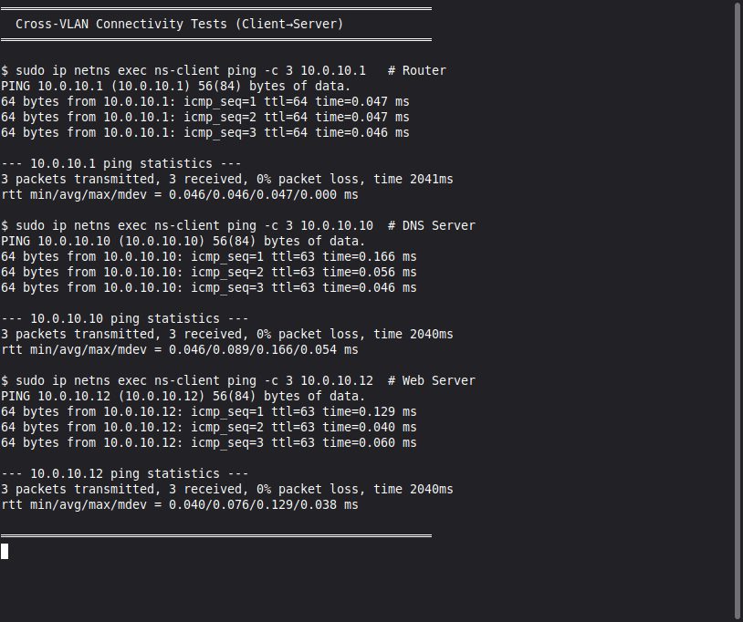
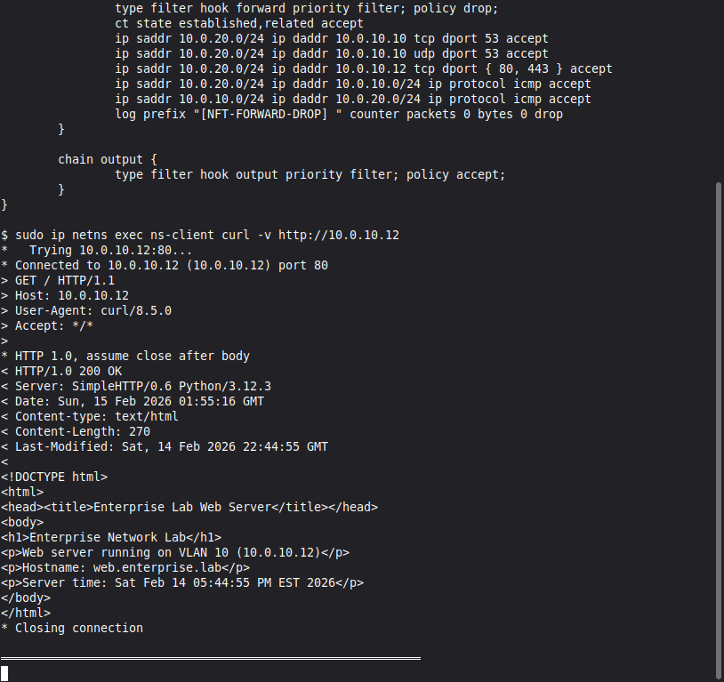
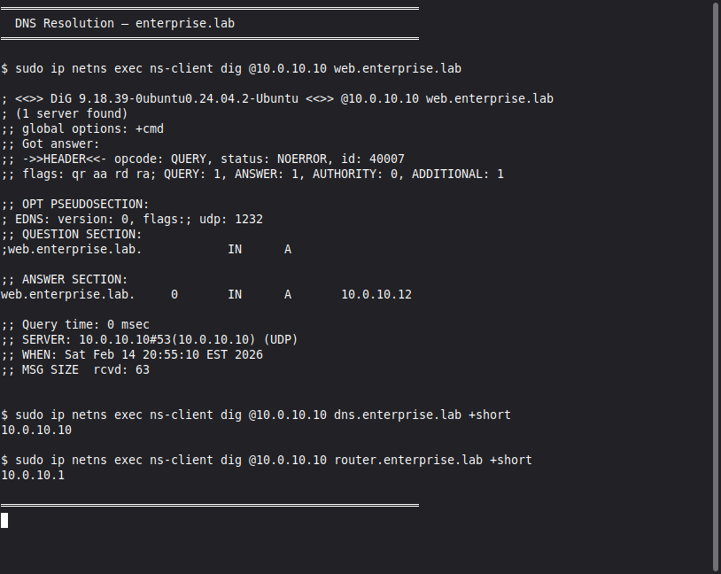

# 🏗️ Enterprise Network Lab — Design, Implementation & Troubleshooting

A fully functional enterprise network lab built from scratch using **Linux network namespaces** — demonstrating network design, VLAN segmentation, inter-VLAN routing, firewalling, DNS services, traffic analysis, and real-world troubleshooting.

> **This project proves you can design, build, and troubleshoot enterprise infrastructure — not just scan things.**

---

## 📐 Network Architecture

### Topology Diagram



### Architecture Overview

```
                    ┌──────────────────┐
                    │    ns-router     │  IP Forwarding + nftables
                    │  10.0.10.1/24    │  VLAN 10 gateway
                    │  10.0.20.1/24    │  VLAN 20 gateway
                    └───┬──────────┬───┘
                        │          │
              ┌─────────┘          └─────────┐
              │                              │
      ┌───────────────┐              ┌───────────────┐
      │   br-vlan10   │              │   br-vlan20   │
      │  (Linux Bridge)│              │  (Linux Bridge)│
      │  VLAN 10       │              │  VLAN 20       │
      └──┬─────────┬──┘              └───────┬───────┘
         │         │                         │
   ┌─────────┐ ┌─────────┐           ┌─────────────┐
   │ ns-dns  │ │ ns-web  │           │  ns-client  │
   │10.0.10.10│ │10.0.10.12│           │ 10.0.20.100 │
   │ dnsmasq │ │ Python  │           │ Test Client │
   └─────────┘ │ HTTP    │           └─────────────┘
               └─────────┘
```

---

## 🌐 IP Addressing Scheme

| Network          | Subnet            | VLAN | Gateway     | Purpose          |
|:-----------------|:------------------|:-----|:------------|:-----------------|
| Server VLAN      | 10.0.10.0/24      | 10   | 10.0.10.1   | Infrastructure   |
| Client VLAN      | 10.0.20.0/24      | 20   | 10.0.20.1   | End Users        |

### Host Assignments

| Host            | IP Address     | VLAN | Role                   |
|:----------------|:---------------|:-----|:-----------------------|
| Router          | 10.0.10.1 / 10.0.20.1 | 10/20 | Default Gateway, Firewall |
| DNS Server      | 10.0.10.10     | 10   | dnsmasq DNS (enterprise.lab) |
| Web Server      | 10.0.10.12     | 10   | Python HTTP Server     |
| Linux Client    | 10.0.20.100    | 20   | Test Endpoint          |

---

## ⚙️ Components & Configuration

### 1. Router (ns-router)
Inter-VLAN routing with IP forwarding and nftables firewall.



**Key features:**
- Dual-homed router connecting VLAN 10 and VLAN 20 via veth pairs
- IP forwarding enabled (`net.ipv4.ip_forward=1`)
- Routes both subnets through the router namespace
- Stateful nftables firewall on the router itself

📄 **Reference config (production VyOS equivalent):** [`configs/router.conf`](configs/router.conf)

---

### 2. Firewall (nftables on ns-router)
VLAN-to-VLAN traffic control with defense-in-depth.



**Policy highlights:**
- Default FORWARD policy: `DROP` (deny all, allow specific)
- VLAN 20 → VLAN 10: Allow DNS (53), HTTP/S (80/443), ICMP
- VLAN 20 → VLAN 10: Block SSH, file shares, lateral movement
- All drops logged with `[NFT-FORWARD-DROP]` prefix

📄 **Config:** [`configs/firewall.rules`](configs/firewall.rules)

---

### 3. VLAN Segmentation (Linux Bridges)
Traffic isolation using per-VLAN bridges and veth pairs.


**Setup:**
- VLAN 10 (`br-vlan10`): Server infrastructure — isolated from client traffic
- VLAN 20 (`br-vlan20`): Client endpoints — restricted server access
- veth pairs connect each namespace to the appropriate bridge
- Router namespace has interfaces on both bridges for inter-VLAN routing

📄 **Reference config:** [`configs/vlan-setup.sh`](configs/vlan-setup.sh)

---

### 4. DNS Server (dnsmasq in ns-dns)
Internal name resolution for `enterprise.lab` domain.



**Features:**
- Forward lookups: `web.enterprise.lab` → `10.0.10.12`
- Hosts file–based resolution for all internal systems
- External query forwarding to `8.8.8.8`
- Query logging for troubleshooting

📄 **Reference configs (production BIND9 equivalent):** [`configs/dns/named.conf`](configs/dns/named.conf) · [`configs/dns/db.enterprise.lab`](configs/dns/db.enterprise.lab)

---

### 5. Web Server (Python HTTP in ns-web)
Serves HTML content from the web server namespace.

**Details:**
- Python 3 `http.server` listening on `10.0.10.12:80`
- Serves a simple HTML page identifying the enterprise lab
- Accessible from the client VLAN (cross-VLAN via router)

---

## 🔧 Troubleshooting Playbooks

Each playbook documents a real failure scenario with: **Symptoms → Diagnosis → Root Cause → Fix → Verification**

| Scenario                  | Root Cause                            | Playbook |
|:--------------------------|:--------------------------------------|:---------|
| 🔴 DNS Outage             | Zone file path incorrect in BIND9     | [dns-outage.md](troubleshooting/dns-outage.md) |
| 🔴 Routing Failure        | Missing VLAN sub-interface on router  | [routing-issue.md](troubleshooting/routing-issue.md) |
| 🔴 VLAN Misconfiguration  | Wrong VLAN tag (200 instead of 20)    | [vlan-misconfig.md](troubleshooting/vlan-misconfig.md) |
| 🔴 DHCP Failure           | DHCP relay not configured for VLAN    | [dhcp-failure.md](troubleshooting/dhcp-failure.md) |
| 🔴 Firewall Block         | HTTP allow rule missing after update  | [firewall-block.md](troubleshooting/firewall-block.md) |

> **This is what hiring managers love** — documented proof you can diagnose and fix real network issues.

---

## 🤖 Automation Scripts

### Lab Setup & Teardown
Build or destroy the full lab environment with a single command.

```bash
sudo bash scripts/lab-setup.sh      # Build entire lab
sudo bash scripts/lab-teardown.sh   # Clean teardown
```

📄 **Scripts:** [`scripts/lab-setup.sh`](scripts/lab-setup.sh) · [`scripts/lab-teardown.sh`](scripts/lab-teardown.sh)

---

### Network Validation Suite
Comprehensive connectivity and service validation.

```bash
sudo bash scripts/validate-network.sh
```
Checks: ICMP reachability, DNS resolution, HTTP, routing table, firewall status.

📄 **Script:** [`scripts/validate-network.sh`](scripts/validate-network.sh)

---

### Python Health Dashboard
Real-time health monitoring with colored output and JSON export.

```bash
python3 scripts/network-health.py           # One-time check
python3 scripts/network-health.py --json    # JSON output
python3 scripts/network-health.py --watch   # Continuous monitoring (30s interval)
```

📄 **Script:** [`scripts/network-health.py`](scripts/network-health.py)

---

### Traffic Capture Automation
Automated pcap capture for DNS, ARP, and TCP traffic.

```bash
sudo bash scripts/capture-traffic.sh dns    # DNS only
sudo bash scripts/capture-traffic.sh arp    # ARP only
sudo bash scripts/capture-traffic.sh tcp    # TCP handshakes
sudo bash scripts/capture-traffic.sh all    # All captures
```

📄 **Script:** [`scripts/capture-traffic.sh`](scripts/capture-traffic.sh)

---

## 📦 Packet Capture & Analysis

Live packet captures from the router interface showing real traffic traversing the network.


| Capture Type | Protocol | Key Observations |
|:-------------|:---------|:-----------------|
| ICMP         | Layer 3  | Echo request/reply, cross-VLAN with ttl=63 |
| ARP          | Layer 2  | MAC resolution between router and servers |
| DNS          | UDP 53   | Query/response pairs for enterprise.lab |
| TCP/HTTP     | TCP 80   | 3-way handshake, GET request, 200 OK response |

📄 **Analysis guide:** [`packet-captures/README.md`](packet-captures/README.md)

---

## 🛠️ Tools Used

| Tool                  | Purpose                              |
|:----------------------|:-------------------------------------|
| Linux Namespaces      | Isolated network stacks (no VMs)     |
| iproute2              | VLAN, bridge & routing configuration |
| nftables              | Stateful firewall rules              |
| dnsmasq               | DNS server (enterprise.lab zone)     |
| Python 3 http.server  | Web server                           |
| tcpdump               | Live packet capture & analysis       |
| Wireshark             | GUI packet analysis (.pcap)          |
| Bash                  | Scripting & automation               |
| Python 3              | Health dashboard & monitoring        |

---

## 📂 Project Structure

```
enterprise-network-lab/
│
├── README.md                          ← You are here
│
├── diagrams/
│   └── network-topology.png           ← Network architecture diagram
│
├── configs/
│   ├── router.conf                    ← VyOS router config (production reference)
│   ├── firewall.rules                 ← nftables firewall ruleset
│   ├── dhcp.conf                      ← ISC DHCP config (production reference)
│   ├── vlan-setup.sh                  ← VLAN & bridge setup script
│   └── dns/
│       ├── named.conf                 ← BIND9 DNS config (production reference)
│       └── db.enterprise.lab          ← DNS zone file
│
├── troubleshooting/
│   ├── dns-outage.md                  ← DNS server failure playbook
│   ├── routing-issue.md               ← Missing route playbook
│   ├── vlan-misconfig.md              ← VLAN tag mismatch playbook
│   ├── dhcp-failure.md                ← DHCP relay failure playbook
│   └── firewall-block.md             ← Firewall misconfiguration playbook
│
├── scripts/
│   ├── lab-setup.sh                   ← Full lab build (namespaces, bridges, services)
│   ├── lab-teardown.sh                ← Clean teardown of all lab resources
│   ├── validate-network.sh            ← Network validation suite
│   ├── capture-traffic.sh             ← tcpdump automation
│   └── network-health.py              ← Python health dashboard
│
├── packet-captures/
│   └── README.md                      ← Capture methodology & analysis
│
└── screenshots/                       ← Real terminal screenshots from running lab
    ├── vlan-interfaces-output.png
    ├── router-config.png
    ├── dns-resolution-output.png
    ├── firewall-rules-output.png
    └── network-validation-output.png
```

---

## 🚀 Quick Start

### Prerequisites
- Linux host (Ubuntu 22.04+ recommended)
- `iproute2`, `nftables`, `dnsmasq`, `tcpdump`, `dig` installed
- Root/sudo access (for network namespaces)

### Setup Steps
1. **Clone the repo** — `git clone https://github.com/Narenpindi123/enterprise-network-lab.git`
2. **Build the entire lab** — `sudo bash scripts/lab-setup.sh`
3. **Verify connectivity** — `sudo ip netns exec ns-client ping 10.0.10.10`
4. **Test DNS** — `sudo ip netns exec ns-client dig @10.0.10.10 web.enterprise.lab`
5. **Test HTTP** — `sudo ip netns exec ns-client curl http://10.0.10.12`
6. **Break & Fix** — Follow troubleshooting playbooks to simulate and resolve failures
7. **Teardown** — `sudo bash scripts/lab-teardown.sh`

---

## 📝 Resume Entry

> **Enterprise Network Design & Troubleshooting Lab**
>
> - Designed and implemented a multi-VLAN enterprise network using Linux network namespaces, bridges, and veth pairs to simulate isolated router, DNS, web server, and client environments on a single host
> - Configured inter-VLAN routing with IP forwarding and nftables firewall rules enforcing a deny-all-allow-specific policy for cross-VLAN traffic (DNS, HTTP, ICMP)
> - Deployed dnsmasq DNS server with enterprise.lab zone, enabling forward lookups, query logging, and external forwarding
> - Performed packet-level traffic analysis using tcpdump to validate ICMP echo, DNS A queries, TCP three-way handshakes, and HTTP request/response flows across VLANs
> - Authored 5 troubleshooting playbooks documenting root cause analysis and remediation for DNS outages, routing failures, VLAN misconfigurations, DHCP relay issues, and firewall blocks
> - Created automation scripts (Bash, Python) for lab provisioning, teardown, network validation, and real-time health monitoring with JSON export

---

## 📄 License

This project is for educational and portfolio purposes. All tools used are free and open-source.
