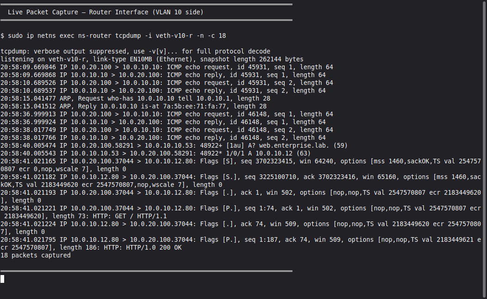

# 🏗️ Enterprise Network Design, Implementation & Troubleshooting Lab

A fully documented enterprise network lab built from scratch — demonstrating network design, VLAN segmentation, routing, firewalling, DNS/DHCP services, traffic analysis, and real-world troubleshooting.

> **This project proves you can design, build, and troubleshoot enterprise infrastructure — not just scan things.**

---

## 📐 Network Architecture

### Topology Diagram


### Architecture Overview

```
[ISP / Internet]
       |
       | 203.0.113.0/30
       |
┌──────────────┐
│  Edge Router  │  VyOS 1.4
│  (VyOS)       │  WAN: 203.0.113.1/30
│               │  LAN: 10.0.1.1/30
└──────┬───────┘
       |
       | 10.0.1.0/30
       |
┌──────────────┐
│   Firewall    │  nftables
│  (nftables)   │  10.0.1.2/30
└──────┬───────┘
       |
┌──────────────┐
│  Core Switch  │  Linux Bridge / OVS
│  (OVS)        │  VLAN Trunk
└──┬────────┬──┘
   |        |
   |        |
┌──────┐ ┌──────┐
│VLAN10│ │VLAN20│
│Servers│ │Clients│
└──────┘ └──────┘
```

---

## 🌐 IP Addressing Scheme

| Network          | Subnet            | VLAN | Gateway     | Purpose          |
|:-----------------|:------------------|:-----|:------------|:-----------------|
| WAN Link         | 203.0.113.0/30    | —    | 203.0.113.2 | ISP Uplink       |
| Transit Link     | 10.0.1.0/30       | —    | 10.0.1.1    | Router ↔ Switch  |
| Server VLAN      | 10.0.10.0/24      | 10   | 10.0.10.1   | Infrastructure   |
| Client VLAN      | 10.0.20.0/24      | 20   | 10.0.20.1   | End Users        |

### Host Assignments

| Host            | IP Address     | VLAN | Role                |
|:----------------|:---------------|:-----|:--------------------|
| Edge Router     | 10.0.10.1      | 10   | Default Gateway     |
| Core Switch     | 10.0.1.2       | —    | Layer 2/3 Switch    |
| DNS Server      | 10.0.10.10     | 10   | BIND9 DNS           |
| DHCP Server     | 10.0.10.11     | 10   | ISC DHCP            |
| Web Server      | 10.0.10.12     | 10   | Apache HTTP         |
| Linux Client    | 10.0.20.100    | 20   | Ubuntu Workstation  |
| Windows Client  | 10.0.20.101    | 20   | Windows 10          |

---

## ⚙️ Components & Configuration

### 1. Edge Router (VyOS)
Inter-VLAN routing, NAT masquerade, DHCP relay, DNS forwarding.


**Key features:**
- Router-on-a-stick with VLAN sub-interfaces (`eth1.10`, `eth1.20`)
- Source NAT for internet access from both VLANs
- DHCP relay forwarding VLAN 20 requests to DHCP server in VLAN 10
- DNS forwarding to internal DNS server

📄 **Config:** [`configs/router.conf`](configs/router.conf)

---

### 2. Firewall (nftables)
VLAN-to-VLAN traffic control with defense-in-depth.


**Policy highlights:**
- Default FORWARD policy: `DROP` (deny all, allow specific)
- VLAN 20 → VLAN 10: Allow DNS (53), HTTP/S (80/443), ICMP
- VLAN 20 → VLAN 10: Block SSH, file shares, lateral movement
- NAT masquerade for outbound internet
- All drops logged with `[NFT-FORWARD-DROP]` prefix

📄 **Config:** [`configs/firewall.rules`](configs/firewall.rules)

---

### 3. VLAN Segmentation (Linux Bridge / OVS)
Traffic isolation using 802.1Q VLANs.


**Setup:**
- VLAN 10 (ID 10): Server infrastructure — isolated from client traffic
- VLAN 20 (ID 20): Client endpoints — restricted server access
- Linux bridges per VLAN for local switching
- Trunk port to router carries tagged traffic

📄 **Config:** [`configs/vlan-setup.sh`](configs/vlan-setup.sh)

---

### 4. DNS Server (BIND9)
Internal name resolution for `enterprise.lab` domain.


**Features:**
- Forward zone: `enterprise.lab` with A records for all hosts
- Reverse zones for PTR lookups
- External query forwarding to `8.8.8.8` / `8.8.4.4`
- Recursive queries restricted to internal VLANs

📄 **Configs:** [`configs/dns/named.conf`](configs/dns/named.conf) · [`configs/dns/db.enterprise.lab`](configs/dns/db.enterprise.lab)

---

### 5. DHCP Server (ISC DHCP)
Automatic IP assignment with per-VLAN scopes.

**Scopes:**
| VLAN   | Range                   | Lease Time | DNS Server  |
|:-------|:------------------------|:-----------|:------------|
| VLAN 10| 10.0.10.100 – .200      | 1 hour     | 10.0.10.10  |
| VLAN 20| 10.0.20.100 – .200      | 1 hour     | 10.0.10.10  |

- Static reservations for DNS, DHCP, and Web servers
- DHCP relay on router for cross-VLAN DHCP

📄 **Config:** [`configs/dhcp.conf`](configs/dhcp.conf)

---

## 🔧 Troubleshooting Playbooks

Each playbook documents a real failure scenario with: **Symptoms → Diagnosis → Root Cause → Fix → Verification**

| Scenario                  | Root Cause                            | Playbook |
|:--------------------------|:--------------------------------------|:---------|
| 🔴 DNS Outage             | Zone file path incorrect in BIND9     | [dns-outage.md](troubleshooting/dns-outage.md) |
| 🔴 Routing Failure        | Missing VLAN sub-interface on router  | [routing-issue.md](troubleshooting/routing-issue.md) |
| 🔴 VLAN Misconfiguration  | Wrong VLAN tag (200 instead of 20)    | [vlan-misconfig.md](troubleshooting/vlan-misconfig.md) |
| 🔴 DHCP Failure           | DHCP relay not configured for VLAN    | [dhcp-failure.md](troubleshooting/dhcp-failure.md) |
| 🔴 Firewall Block         | HTTP allow rule missing after update  | [firewall-block.md](troubleshooting/firewall-block.md) |

> **This is what hiring managers love** — documented proof you can diagnose and fix real network issues.

---

## 🤖 Automation Scripts

### Network Validation Suite
Comprehensive connectivity and service validation.


```bash
sudo bash scripts/validate-network.sh
```
Checks: ICMP reachability, DNS resolution, DHCP, HTTP, routing table, firewall status.

📄 **Script:** [`scripts/validate-network.sh`](scripts/validate-network.sh)

---

### Python Health Dashboard
Real-time health monitoring with colored output and JSON export.



```bash
python3 scripts/network-health.py           # One-time check
python3 scripts/network-health.py --json    # JSON output
python3 scripts/network-health.py --watch   # Continuous monitoring (30s interval)
```

📄 **Script:** [`scripts/network-health.py`](scripts/network-health.py)

---

### Traffic Capture Automation
Automated pcap capture for DNS, ARP, and TCP traffic.

```bash
sudo bash scripts/capture-traffic.sh dns    # DNS only
sudo bash scripts/capture-traffic.sh arp    # ARP only
sudo bash scripts/capture-traffic.sh tcp    # TCP handshakes
sudo bash scripts/capture-traffic.sh all    # All captures
```

📄 **Script:** [`scripts/capture-traffic.sh`](scripts/capture-traffic.sh)

---

## 📦 Packet Capture Analysis

Detailed analysis of captured network traffic with Wireshark filters and examples.

| Capture Type | Protocol | Key Observations |
|:-------------|:---------|:-----------------|
| DNS          | UDP 53   | Query/response pairs, NXDOMAIN detection |
| ARP          | Layer 2  | MAC resolution, gratuitous ARP, spoofing |
| TCP          | TCP      | 3-way handshake, retransmissions, RST    |

📄 **Analysis:** [`packet-captures/README.md`](packet-captures/README.md)

---

## 🛠️ Tools Used

| Tool                  | Purpose                              |
|:----------------------|:-------------------------------------|
| Linux Namespaces      | Isolated network stacks (no VMs)     |
| iproute2              | VLAN, bridge & routing configuration |
| nftables              | Stateful firewall rules              |
| dnsmasq               | DNS server (enterprise.lab zone)     |
| Python 3 http.server  | Web server                           |
| tcpdump               | Live packet capture & analysis       |
| Wireshark             | GUI packet analysis (.pcap)          |
| Bash                  | Scripting & automation               |
| Python 3              | Health dashboard & monitoring        |

---

## 📂 Project Structure

```
enterprise-network-lab/
│
├── README.md                          ← You are here
│
├── diagrams/
│   └── network-topology.png           ← Network architecture diagram
│
├── configs/
│   ├── router.conf                    ← VyOS router configuration
│   ├── firewall.rules                 ← nftables firewall ruleset
│   ├── dhcp.conf                      ← ISC DHCP server config
│   ├── vlan-setup.sh                  ← VLAN & bridge setup script
│   └── dns/
│       ├── named.conf                 ← BIND9 DNS server config
│       └── db.enterprise.lab          ← DNS zone file
│
├── troubleshooting/
│   ├── dns-outage.md                  ← DNS server failure playbook
│   ├── routing-issue.md               ← Missing route playbook
│   ├── vlan-misconfig.md              ← VLAN tag mismatch playbook
│   ├── dhcp-failure.md                ← DHCP relay failure playbook
│   └── firewall-block.md             ← Firewall misconfiguration playbook
│
├── scripts/
│   ├── lab-setup.sh                   ← Full lab build (namespaces, bridges, services)
│   ├── lab-teardown.sh                ← Clean teardown of all lab resources
│   ├── validate-network.sh            ← Network validation suite
│   ├── capture-traffic.sh             ← tcpdump automation
│   └── network-health.py              ← Python health dashboard
│
├── packet-captures/
│   └── README.md                      ← Capture methodology & analysis
│
└── screenshots/                       ← Real screenshots from running lab
    ├── router-config.png
    ├── firewall-rules-output.png
    ├── dns-resolution-output.png
    ├── vlan-interfaces-output.png
    ├── network-validation-output.png
    └── health-dashboard-output.png
```

---

## 🚀 Quick Start

### Prerequisites
- Linux host (Ubuntu 22.04+ recommended)
- `iproute2`, `nftables`, `dnsmasq`, `tcpdump` installed
- Root/sudo access (for network namespaces)

### Setup Steps
1. **Clone the repo** — `git clone https://github.com/yourusername/enterprise-network-lab.git`
2. **Build the entire lab** — `sudo bash scripts/lab-setup.sh`
3. **Verify connectivity** — `sudo ip netns exec ns-client ping 10.0.10.10`
4. **Test DNS** — `sudo ip netns exec ns-client dig @10.0.10.10 web.enterprise.lab`
5. **Test HTTP** — `sudo ip netns exec ns-client curl http://10.0.10.12`
6. **Break & Fix** — Follow troubleshooting playbooks to simulate and resolve failures
7. **Teardown** — `sudo bash scripts/lab-teardown.sh`

---

## 📝 Resume Entry

> **Enterprise Network Design & Troubleshooting Lab**
>
> - Designed and implemented a multi-subnet enterprise network using VLAN segmentation, inter-VLAN routing, and firewall policies to simulate real-world infrastructure
> - Configured core network services including DHCP, DNS, NAT, and static routing, ensuring reliable connectivity across Linux and Windows endpoints
> - Performed packet-level traffic analysis using Wireshark and tcpdump to validate TCP handshakes, DNS resolution, and routing behavior
> - Simulated and resolved common enterprise network failures (DNS outages, routing misconfigurations, firewall blocks), documenting root cause analysis and remediation steps
> - Created detailed network diagrams, configuration documentation, and troubleshooting playbooks to support operational handover

---

## 📄 License

This project is for educational and portfolio purposes. All tools used are free and open-source.
